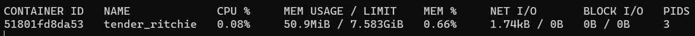
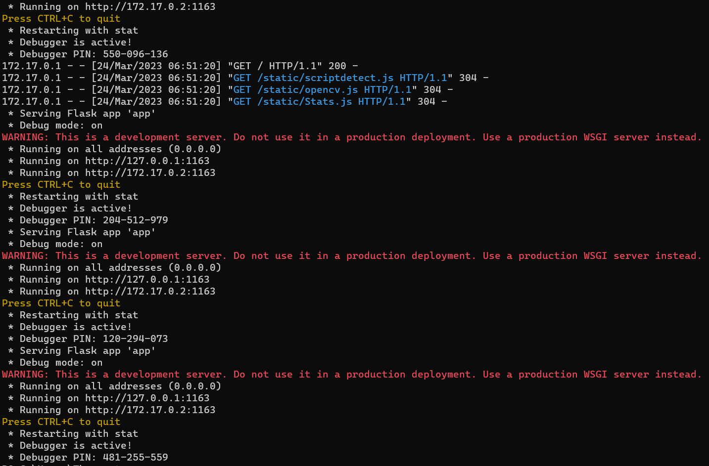
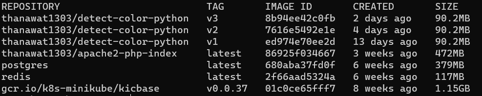
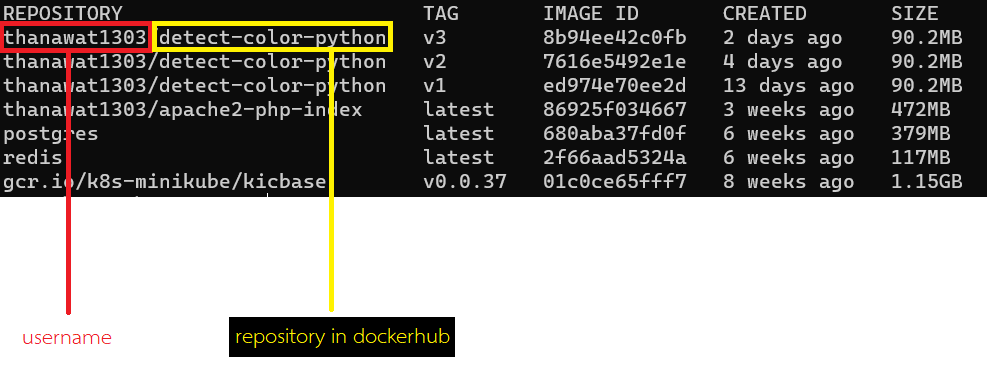
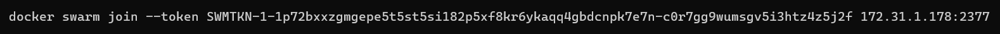
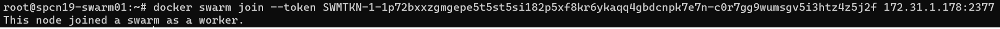
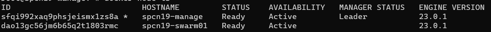

# DOCKER
## What is ?

<div align=center></div>

- แพลตฟอร์มที่ช่วยในการ สร้าง ทดสอบ ใช้งานแอปพลิเคชันจริง ที่มีเฉพาะสภาพแวดล้อมที่พร้อมสำหรับแอปพลิเคชัน เป็นเหมือนกับ container ทำให้ติดตั้งแอปพลิเคชันได้รวดเร็ว ง่ายต่อการนำมาใช้ และการจัดการแอปพลิเคชัน โดยควบคุมและทำงานภายใต้ docker engine
- ปลาวาฬ(Docker) ที่แบก container 

## Topic Lerning
- [Basic command](#basic-command)
- [DockerFile](#dockerfile)
- [Docker Network](#network-docker)
- [Docker compose](#docker-compose-yml)
- [Docker swarm](#docker-swarm)

---

## Basic command
- ตรวจสอบเวอร์ชั่น
  ```
  docker version
  ```

- แสดงสถานะการทำงานของ docker container แบบ realtime
  ```
  docker stats
  ```

<div align=center></div>

- แสดง logs ของ docker container ตั้งแต่เริ่มทำงาน
  ```t
  docker logs [ID หรือ ชื่อ container] [option]
  ```
  - option
    - -f : ดูแบบ process realtime หรือ ฟอร์กาว
    ```
    docker logs [ID หรือ ชื่อ container] -f
    ```

<div align=center></div>  
    
- ตรวจสอบ docker container ที่กำลังทำงาน
  ```
  docker ps [option]
  ```
  - option
    - -a : แสดง docker container ทั้งหมด ทั้งที่ทำงานอยู่ และที่เคยทำงาน
    ```
    docker ps -a
    ```

- ดาวโหลด docker image จาก dockerhub
  ```
  docker pull [image]:[tag]
  ```

- เริ่มทำงาน docker container จาก docker image โดยหากในเครื่องไม่มีจะทำการ pull จาก dockerhub
  ```
  docker run [option] [image]
  ```
  - option 
    - --name : กำหนดชื่อ docker container
    - -p : กำหนด port ในการใช้งาน service บน docker container 
	[port ที่ให้ทำงานบน Host]:[port ที่ service ทำงานบน docker container]
    - -d : demon สั่งให้ทำงานในพื้นหลัง จะตรงข้ามกับ -f
    - -v : พื้นที่เก็บข้อมูลที่ต้องการให้เชื่อมต่อกันระหว่าง host กับ docker container ป้องกันการสูญเสียข้อมูลหาก container down
	[path ใน host]:[path ใน docker container ที่ต้องการให้เชื่อมต่อ]
    - --hostname : กำหนด hostname
    ```
    docker run --name nginx -p 80:80 -d -v ./app:/var/html/www/ --hostname nginx nginx #ค่าสุดท้าย คือ image ที่ต้องการ
    ```

- สั่ง docker container ที่ปิดใช้งานอยู่ ให้เปิดใช้งาน
  ```
  docker start [ID หรือ ชื่อ container]
  ```

- สั่ง docker container ที่เปิดใช้งานอยู่ ให้ปิดใช้งาน
  ```
  docker stop [ID หรือ ชื่อ container]
  ```

- ลบ docker container
  ```
  docker rm [ID หรือ ชื่อ container] [option]
  ```
  - option 
    - -f : ลบ container ที่กำลังทำงานได้ เพราะหากสั่งลบ โดยไม่ใช้ option นี้ จะไม่สามารถลบ docker container ที่กำลังทำงานได้
    ```
    docker rm [ID หรือ ชื่อ container] -f
    ```
- แสดงรายการ image ที่อยู่ในเครื่อง
  ```
  docker images
  ```

<div align=center></div>

- ลบ image ที่อยู่ในเครื่อง
  ```
  docker rmi [repo หรือ id image]
  ```

- สร้าง image จาก Dockerfile
  ```
  docker build [path Dockerfile] [option]
  ```
  - option
    - -t กำหนด repository image:tag image
      ```
      docker build Dockerfile -t [username/repository]:[tag]
      ```
      - username : username dockerhub
      - repository : repository ที่ต้องการใน dockerhub
      - tag : ห้ามซ้ำกับชื่อ repository เดียวกัน เป็นเหมือน version

<div align=center></div>

- อัปโหลด image ไปที่ repository 
  - โดยในที่นี้คือ dockerhub โดยต้องทำการ login dockerhub ก่อน
  ```
  docker push [repository image]:[tag]
  ```
  - [repository image] => username/repository
    - username : username dockerhub
    - repository : repository หากยังไม่สร้าง จะทำการสร้างโดยอัตโนมัติ
  
<div align=center></div>

- login dockerhub
  ```
  docker login
  ```

## DockerFile
- ไฟล์ข้อความสำหรับใช้ในการสร้าง image โดยสามารถกำหนดคำสั่งต่าง ๆ เข้าไปได้

- คำสั่งใน Dockerfile
  - FROM : repository ของ base image ที่เราจะนำมาเป็นฐานในการสร้าง image
    ```ruby
    FROM <image ที่ต้องการ>
    ```
    - --platform=$BUILDPLATFORM : multi platform ทำให้ dockerfile ทำงานได้ทุก platform
    ```ruby
    FROM --platform=$BUILDPLATFORM <image ที่ต้องการ>
    ```

  - RUN : คำสั่งรัน command ระหว่างสร้าง image โดยจะเป็น command ตาม base image ที่มาจาก from
    ```ruby
    RUN <คำสั่งที่ต้องการให้ทำงาน>
    ```

  - LABEL : กำหนด metadata เพื่ออำนวยความสะดวกในการจัดการ image
    ```ru
    LABEL maintainer="Thanawat Imala-o <1163104005900@mail.rmutt.ac.th>"
    LABEL description="This is sample"
    LABEL version="1.5"
    ```

  - COPY : คัดลอกไฟล์ หรือ โฟลเดอร์ จาก Host เข้าไปใน image ที่กำลังสร้างขึ้น โดยหากไม่กำหนด
    ```ruby
    COPY <path ใน HOST> <path ใน docker container>
    ```

  - ADD : เหมือน copy แต่สามารถ copy จาก remote URL ก็คือจากลิ้งค์ได้ สามารถแตกไฟล์ก่อน copy ได้
    - Local
      ```ruby
      ADD <path ใน HOST> <path ใน docker container>
      ```
    - Remote URL
      ```ruby
      ADD <URL file> <path ใน docker container>
      ```

  - ENV : กำหนดตัวแปร environment ที่จะเอาไว้ใช้งานใน container
    ```ru
    ENV <ชื่อตัวแปร>=<ค่า>
    ```

  - VOLUME : กำหนดเส้นทางในการเชื่อมต่อข้อมูลของตัว container โดยเป็นการกำหนดช่องทางไว้ ว่าให้ช่องทางนี้เชื่อมต่อข้อมูลได้
    - เหมือนกำหนดไว้ว่าจุดนี้คือจุดที่ container ใช้ในการเชื่อมต่อข้อมูล ให้ง่ายในการแก้ไข
    - คล้ายกับ EXPOSE
    ```ru
    VOLUME /app #กำหนดให้รู้ว่าจะเชื่อมต่อข้อมูลผ่าน path /app
    VOLUME ["/data", "/app"] #กำหนดหลายจุด
    ```

  - WORKDIR : สำหรับกำหนดโฟลเดอร์ในการทำงานของคำสั่ง ในขณะที่ image กำลังสร้างขึ้น เพื่อง่ายต่อการเรียกใช้โฟลเดอร์และไฟล์ จากคำสั่งที่ทำงานหลังจากนี้
    - เช่น หากสั่งคำสั่ง WORKDIR /app ก็จะหมายความว่าตอนนี้ command ที่สั่งหลังจากนี้จะทำงานใน path /app หากสั่งคำสั่ง COPY /app . ก็คือ ก๊อปปี้โฟลเดอร์ app จาก Host ไปที่ Path ที่ WORKDIR คือ /app
    ```ruby
    WORKDIR /app
    ```

  - EXPOSE : กำหนด port ที่ให้ Host เข้าถึง services หรือ application ใน docker contianer ได้ โดยตัว app หรือ service ก็ต้องมา listen ที่ port นี้เพื่อให้เชื่อมถึงกันได้ เหมือนเป็นการระบุไว้ว่าทางนี้สามารถเข้าไปได้
    ```ruby
    EXPOSE port
    ```

  - CMD : สั่งรัน command หลังจาก docker container เริ่มทำงาน เป็น command ที่เป็นค่า default ถูกแทนที่คำสั่งได้
    - default ก็คือ หากไม่มีกำหนดมาจาก command ที่ผู้ใช้สั่ง ด้วยคำสั่งใดก็ตามที่ใช้ในการสร้าง container เช่น docker run คำสั่งใน CMD จะถูกใช้งานเสมอ
    ```ruby
    CMD [<command ที่ต้องการ โดยจะใช้ , ในการแบ่งระหว่างคำสั่งกับ parameter>]
    ```

  - ENTRYPOINT : สั่งรัน command หลังสร้าง container เริ่มทำงาน ไม่สามารถถูกแทนที่คำสั่งได้ แต่ส่ง parameter ให้ได้
    ```ruby
    ENTRYPOINT [<command ที่ต้องการ โดยจะใช้ , ในการแบ่งระหว่างคำสั่งกับ parameter>]
    ```
    - ใช้ร่วมกับ CMD
      ```ruby
      ENTRYPOINT [<command หลัก หรือตัวโปรแกรม>]
      CMD [<parameter ที่ต้องการ>]
      ```
  - USER : กำหนด user ที่จะทำงานใน container ป้องกันการรันผ่านสิทธิ์ root โดยจะสร้างเอง หรือ จาก base image
    - สร้างเอง
      ```ruby
      RUN adduser --disabled-password myuser
      USER myuser
      ```
  
  - ARG กำหนดตัวแปรเพื่อใช้งานใน Dockerfile สำหรับตอน build image สามารถกำหนดในคำสั่ง docker build ได้
    ```ru
    ARG <ชื่อตัวแปร>=<ค่าที่ต้องการ>
    ```

  - ONBUILD : สั่งให้ทำงานคำสั่งนั้น ๆ ของ dockerfile หากเอา image ไปใช้งานเป็น base image
    ```ru
    ONBUILD <คำสั่ง dockerfile>
    ```
    - Ex.
      ```ruby
      FROM alpine

      ONBUILD LABEL maintainer="Thanawat Imala-o <1163104005900@mail.rmutt.ac.th>" #หากเอา image นี้ไปใช้ จะมีคำสั่งนี้ติดไปด้วย
      ``` 

  - STOPSIGNAL : กำหนดรูปแบบสัญญาณในการสั่ง stop container
    - SIGTERM : สุภาพ
    - SIGINT : ทันที
    - SIGQUIT : ให้ทำการคืนค่า Stack Trace และ มีการตรวจสอบ debug
    - SIGKILL : ทำลาย
    ```ru
    STOPSIGNAL SIGTERM
    ```

  - SHELL : กำหนด shell ที่ใช้ทำงานกับคำสั่งในขณะ build image โดยพื้นฐานจะเป็น sh เช่น คำสั่งภายใต้ คำสั่ง RUN
    ```ru
    SHELL ["/bin/bash", "-c"] #เปลี่ยนไปใช้ชนิด bash
    ```

## Network Docker
- เครือข่ายที่ถูกสร้างด้วย docker ที่สามารถทำให้ container สื่อสาร แชร์ข้อมูลกันได้ง่ายขึ้น และเชื่อมต่อแหล่งข้อมูลภายนอกได้
- สร้าง network สำหรับ docker
  ```
  docker network create --driver=overlay [ชื่อ network]
  ```
  - overlay
    - เครือข่ายที่ช่วยให้ docker สามารถใช้งานได้พร้อมกันในเครือข่ายเดียวกัน สำหรับไว้ติดต่อข้อมูลหากัน  

- เชื่อมต่อ container กับ network
  ```
  docker network connect [ชื่อ network] [container]
  ```

- ยกเลิกการเชื่อมต่อ container กับ network
  ```
  docker network disconnect [ชื่อ network] [container]
  ```

## Docker compose yml
- ช่วยให้สามารถสร้าง docker container ได้ โดยกำหนดค่าต่าง ๆ ผ่านไฟล์ .yaml เปรียบเสมือนคำสั่ง docker run และ ง่ายต่อการจัดการ docker container

- ตัวอย่างไฟล์
  ```yaml
  services: #กำหนดเพื่อสร้าง services
  web: #ชื่อ services
    build: # build image จาก docker file และนำ image มาใช้งาน
      context: app #path docker file
      target: builder
    ports: #กำหนด port การทำงาน
      - '80:80' # port บน host : port ที่ service ทำงานบน docker container
    volumes: #กำหนดที่เก็บข้อมูลให้ทำการเชื่อมต่อกัน
      - ./app:/var/www/html/ # path บน host : path บน container
  ```

- ตัวอย่างไฟล์ ในการกำหนด เครือข่ายในการติดต่อระหว่าง service
  ```yaml
    services:
        nc:
            image: nextcloud:apache
            ports:
                - 80:80
            networks:
                - redisnet #เครือข่าย ที่ใช้ติดต่อร่วมกัน ต้องเป็นเครือข่ายเดียวกัน โดยใช้ติดต่อ redis
                - dbnet #เครือข่าย ที่ใช้ติดต่อร่วมกัน ต้องเป็นเครือข่ายเดียวกัน โดยใช้ติดต่อ db
        redis:
            image: redis:alpine
            networks:
                - redisnet #เครือข่าย ที่ใช้ติดต่อร่วมกัน ต้องเป็นเครือข่ายเดียวกัน โดยใช้ติดต่อ redis
            expose:
                - 6379
        db:
            image: mariadb:10.5
            networks:
                - dbnet #เครือข่าย ที่ใช้ติดต่อร่วมกัน ต้องเป็นเครือข่ายเดียวกัน โดยใช้ติดต่อ db
    networks: # กำหนดเครือข่ายของ service ที่สร้างผ่านไฟล์ compose นี้
        dbnet:
        redisnet:
  ```

- สร้าง docker container จากไฟล์ .yaml
  ```
  docker compose -f .\compose.yaml up [option]
  ```
  - -f : กำหนดให้รัน path filename .yaml
  - option
    - --build : สร้าง image ใหม่ ตามคำสั่งในไฟล์ yaml โดยหากมีแล้วจะสร้างซ้ำ
    - -d : demon รันเสร็จทำงานอยู่เบี้องหลัง

- ลบ docker container ที่สร้างจากไฟล์ .yaml โดยจะลบ container และ network ออกจากเครื่อง จึงง่ายต่อการจัดการ
  ```
  docker compose -f .\compose.yaml down
  ```
  - -f : กำหนดให้รัน path filename .yaml

## Docker swarm
- เป็นการกระจายงานสำหรับการทำงานที่ต้องการใช้งานหลาย services สามารถกำหนด scale ของ services เพื่อเลือกเครื่องที่พร้อมสำหรับ service นั้นได้ โดย deploy service ผ่านไฟล์ .yaml

- Traefik network

- เครื่องที่ทำงานต้องลง docker engine
- โดยจะเป็นการทำงานแบบ
  - master
    - เครื่องที่ไว้สำหรับ กำหนด ควบคุม และกระจายงาน services ต่าง ๆ 
    - manager กำหนดเลขคี่ เพื่อให้มีความลงตัวในการตัดสินใจ 
    - แนะนำให้มีได้มากสุด 7 เครื่อง มากกว่า 7 ประสิทธิภาพน้อยลง
  - worker
    - เครื่องที่ไว้สำหรับนำ container ที่มี service ไปทำงานอยู่

- command swarm
  - master
    - กำหนดเครื่อง manager
      ```
      docker swarm init
      ```
      - จะได้รับ token
        

      - นำ Token ไปรันบนเครื่อง worker ที่ต้องการ
          

    - ตรวจสอบ worker ที่ทำงานใน swarm เดียวกัน
      ```
      docker node ls
      ```
        
      
    - ติดตั้ง portainer CE
      ```
      #ref https://docs.portainer.io/start/install-ce/server/swarm/linux
      curl -L https://downloads.portainer.io/ce2-19/portainer-agent-stack.yml -o portainer-agent-stack.yml 
      docker stack deploy -c portainer-agent-stack.yml portainer
      ```
    
    - ตรวจสอบ services
      ```
      docker service ls
      ```
    
    - สร้าง stack สำหรับ swarm
      ```
      docker stack deploy -c [ชื่อไฟล์ .yaml] [ชื่อ continaer]
      ```

- ตัวอย่างไฟล์ .yaml swarm
  ```yaml
  version: '3.3' #ต้องเวอร์ชั่นมากกว่า 3
  services: 
      api: 
          image: thanawat1303/fastapi-main:v1
          environment: 
              PORT: 8000
          volumes: 
              - /var/run/docker.sock:/var/run/docker.sock
              - app:/app
          deploy: # กำหนดการ Deploy
              replicas: 1 # กำหนดจำนวนที่ต้องการให้ไปสร้าง container เพื่อเริ่มทำงาน service โดยใช้ global เพื่อสร้างทุก node ที่สร้างได้
              resources: # กำหนดความต้องการของ service
                  reservations: # ค่าต่ำสุด
                      cpus: '0.1' 
                      memory: 10M
                  limits: # ค่าสูงสุด
                      cpus: '0.4'
                      memory: 250M
  ```
  - replicas : หากต้องการให้มีทุก node ที่พร้อมให้กำหนดเป็น `global`
